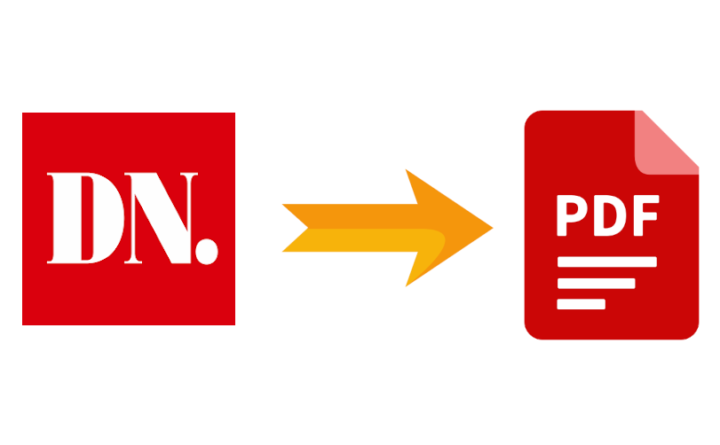

# dn_to_pdf

Parser for taking articles from the Swedish newspaper Dagens Nyheter, and turning them into PDFs for easy and convenient reading offline.

Given a URL to an author on dn.se, all their articles will be downloaded. The downloaded HTML will be parsed into [Markdown](https://en.wikipedia.org/wiki/Markdown), and all images associated with the article will be downloaded and shrunk down. The Markdown will be turned into Latex. Finally, the script will loop over all years, assembling all articles from a given year into a PDF.

## Cookie
To use the script, you must have a subscription to Dagens Nyheter. Your login information is stored in a cookie and sent by the browser to the site, which is how it can identify that you have access to the pages behind the paywall. You need to provide this cookie to the script. How to obtain the cookie depends on your browser.

### Firefox
Make sure you are logged in to dn.se.

[!Finding cookies](finding_cookies.png)

In Firefox, go to Tools -> Browser tools -> Web Developer Tools. Open the Network tab. Click on the GET request to domain www.dn.se. To the right, you have the Headers tab. Scroll down to the Request Headers, and find the request header named "Cookie". Copy this value, and open the file dn_header in a text editor. Replace "xxx" with the cookie you copied.

## Tools
The following tools are needed to run the script:

* Unix tools
* [cmark-gfm](https://github.com/github/cmark-gfm)
* curl
* ImageMagick
* xelatex

## Legal
This script requires you to have a subscription to Dagens Nyheter - you cannot use it to obtain articles you don't have access to. These scripts are provided for personal use; all articles you download are copyrighted to Dagens Nyheter AB and may not be distributed to anyone without their permission. The scripts are for personal use only for already paying customers of Dagens Nyheter.
