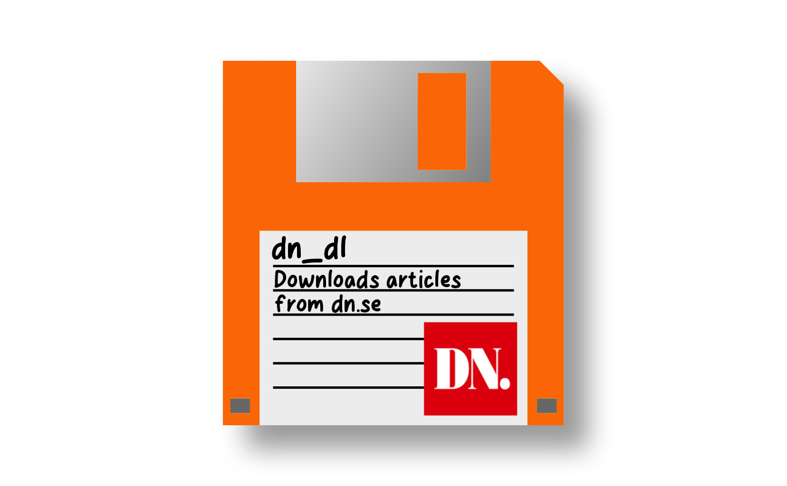

# dn_dl

Parser for taking articles from the Swedish newspaper Dagens Nyheter, and turning them into Markdown, PDFs or EPUBs for easy and convenient reading offline.

Given a URL to an author on dn.se, all their articles will be downloaded. The downloaded HTML will be parsed into [Markdown](https://en.wikipedia.org/wiki/Markdown), and all images associated with the article will be downloaded and optionally shrunk down.

The Markdown can be turned into PDFs using Latex, or to EPUBs using [mark2epub](https://github.com/AlexPof/mark2epub). Finally, the script can loop over all years, assembling all articles from a given year into a PDF or EPUB.

## Cookie

To use the script, you must have a subscription to Dagens Nyheter. Your login information is stored in a cookie and sent by the browser to the site, which is how it can identify that you have access to the pages behind the paywall. You need to provide this cookie to the script by putting it in the `--cookie` parameter. How to obtain the cookie depends on your browser.

### Firefox

Make sure you are logged in to dn.se.

In Firefox, go to Tools -> Browser tools -> Web Developer Tools. Open the Network tab. Click on the GET request to domain www.dn.se. To the right, you have the Headers tab. Scroll down to the Request Headers, and find the request header named "Cookie". Copy this value, and provide it in the `--cookie` parameter to the script.

## Tools

The following tools are needed to run the script:

* Unix tools
* curl
* ImageMagick if shrinking images (default behaviour)
* [cmark-gfm](https://github.com/github/cmark-gfm) if creating PDFs
* [mark2epub](https://github.com/AlexPof/mark2epub) if creating EPUBs
* xelatex if creating PDFs

## Legal

Dagens Nyheter AB is in not affiliated with this project in any way or form. The project is distributed in the hope that it will be useful, but WITHOUT ANY WARRANTY; without even the implied warranty of MERCHANTABILITY or FITNESS FOR A PARTICULAR PURPOSE. These scripts require you to have a subscription to Dagens Nyheter - you cannot use it to obtain articles you don't have access to. The scripts are provided for personal use; all articles you download are copyrighted to Dagens Nyheter AB and may not be distributed to anyone without their permission. The scripts are for personal use only for already paying customers of Dagens Nyheter.
